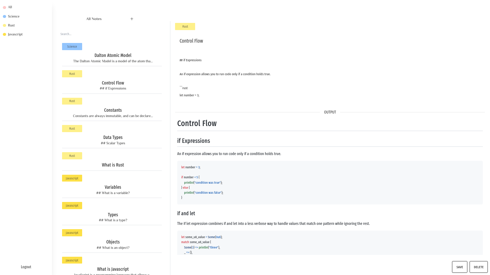
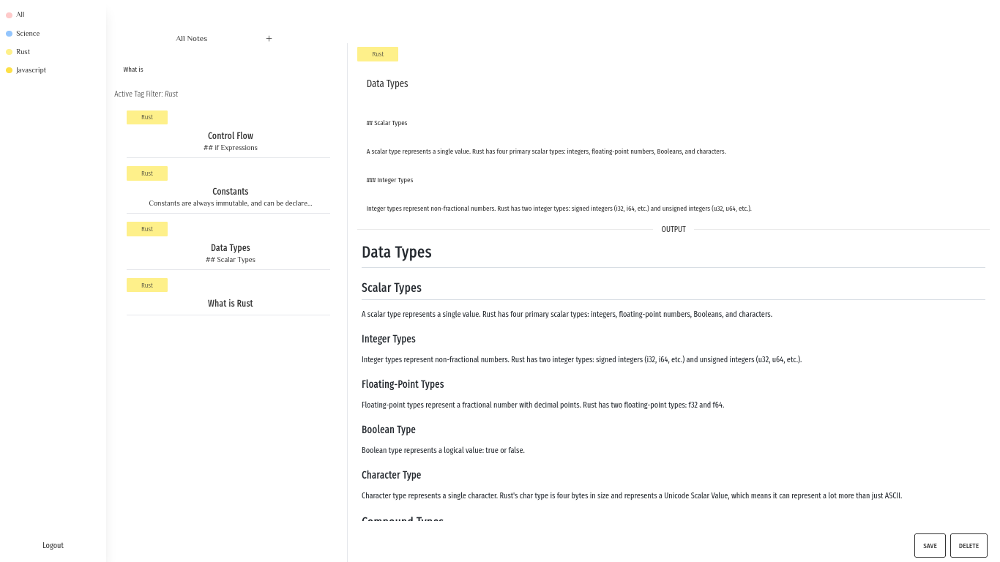
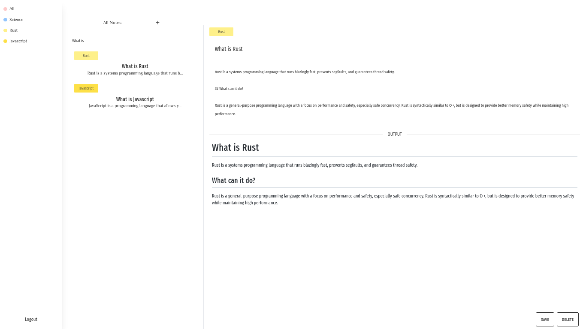
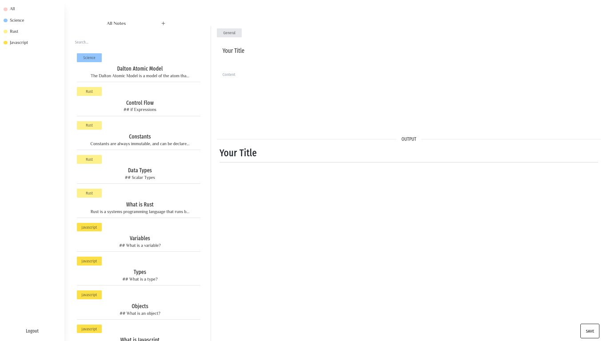
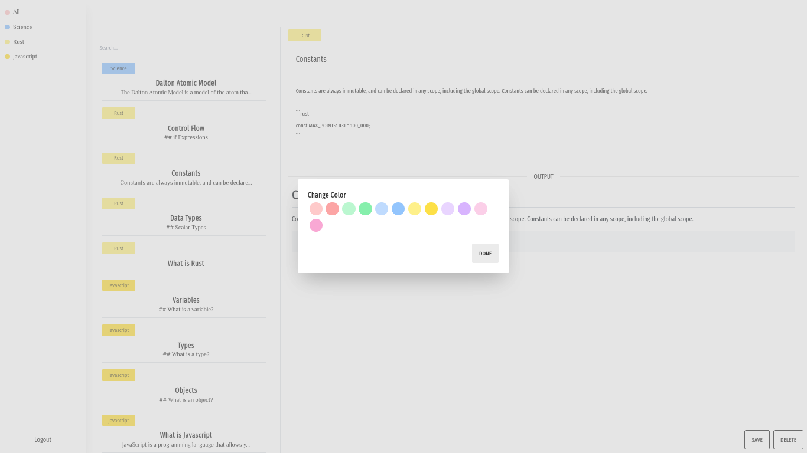

# ANote | Esquenta Programa de Formação FCamara

<div id='top'></div>

_[Leia em português](#Portugues)_

      

<td></td>

# About it



**Anote** is a tag based note-taking plataform where you can organize your notes with a powerful markdown editor that supports images, tables, videos, and much more using tags.

Anote provides a clean, simple and intuitive interface to help you organize your notes and make your life easier.

This project consists of 4 pages:

| File Name           | Page       | Utility       | Access            | Redirects to |
| ------------------- | ---------- | ------------- | ----------------- | ------------ |
| pages/index.js      | /          | Landpage      | Anyone            |              |
| pages/login.jsx     | /login     | Login page    | Not-Authenticated | /dashboard   |
| pages/register.jsx  | /register  | Register page | Not-Authenticated | /dashboard   |
| pages/dashboard.jsx | /dashboard | Main Editor   | Authenticated     | /login       |

This app was built using next.js, react.js, and supabase, here a table with the technologies used:

| Technology | Link                 |
| ---------- | -------------------- |
| Next.js    | https://nextjs.org/  |
| React.js   | https://reactjs.org/ |
| Supabase   | https://supabase.io/ |
| Vercel     | https://vercel.com/  |

Project link: https://anote.vercel.app/

# Getting Started

## Prerequisites

- [Node.js](https://nodejs.org/en/)

## Installation

1. Clone the repo

```sh
git clone https://github.com/mateusdcc/anote
```

2. Install NPM packages

```sh
npm install
```

3. Create a .env.local file and add your supabase url and key

```sh
NEXT_PUBLIC_SUPABASE_URL=your-supabase-url
NEXT_PUBLIC_SUPABASE_KEY=your-supabase-key
```

4. Run the app

```sh
npm run dev
```

# Contributing

Any contributions you make are **greatly appreciated**, but it is going to be sent to another branch and merged after 10/8, the `main` branch solely purpose is to the Orange Juice Program, which is individual.

# License

Distributed under the MIT License. See `LICENSE` for more information.

# Using the app

## Registering

To register, you need go to the page [`/register`](http://anoteapp.vercel.app/register) and fill the form with your email, and password. After that, you are going to receive an email with a link to confirm your account. After confirming your account, you are going to be redirected to the landpage where you can access the dashboard by pressing the dashboard button on the right top corner or going to [here](https://anoteapp.vercel.app/dashboard).

## Logging in

To log in, you need go to the page [`/login`](http://anoteapp.vercel.app/login) and fill the form with your email, and password. If your credentials are correct, you are going to be redirected to the dashboard.

## Dashboard

The dashboard is the main page of the app, where you can create, edit, and delete notes. To get a full walkthrough of the dashboard, you can watch the video below.

[](https://www.youtube.com/watch?v=DoZmE2qzfAA)

## Showcase images

### Filtering by tag



### Filtering by name



### New Note Modal



### Tag Color Changer



### Editing Note


# Contact

Email: mateusdc@proton.me
Discord: Monkagoras#1790

---

<div id="Portugues">

# Sobre


**Anote** é uma plataforma de anotações baseada em tags onde você pode organizar suas anotações com um poderoso editor de markdown que suporta imagens, tabelas, vídeos e muito mais usando tags.

Este projeto consiste em 4 páginas:

| Nome do Arquivo     | Página     | Utilidade          | Acesso          | Redireciona para |
| ------------------- | ---------- | ------------------ | --------------- | ---------------- |
| pages/index.js      | /          | Landpage           | Qualquer um     |                  |
| pages/login.jsx     | /login     | Página de login    | Não-autenticado | /dashboard       |
| pages/register.jsx  | /register  | Página de registro | Não-autenticado | /dashboard       |
| pages/dashboard.jsx | /dashboard | Editor principal   | Autenticado     | /login           |

Este aplicativo foi construído usando next.js, react.js e supabase, aqui uma tabela com as tecnologias usadas:

| Tecnologia | Link                 |
| ---------- | -------------------- |
| Next.js    | https://nextjs.org/  |
| React.js   | https://reactjs.org/ |
| Supabase   | https://supabase.io/ |
| Vercel     | https://vercel.com/  |

Link do projeto: https://anote.vercel.app/

# Começando

## Pré-requisitos

- [Node.js](https://nodejs.org/en/)

## Instalação

1. Clone o repositório

```sh
git clone https://github.com/mateusdcc/anote
```

2. Instale os pacotes NPM

```sh
npm install
```

3. Crie um arquivo .env.local e adicione sua url e chave do supabase

```sh
NEXT_PUBLIC_SUPABASE_URL=your-supabase-url
NEXT_PUBLIC_SUPABASE_KEY=your-supabase-key
```

4. Execute o aplicativo

```sh
npm run dev
```

# Contribuindo

Qualquer contribuição que você fizer é **muito apreciada**, mas será enviada para outra branch e mesclada após 10/8, a branch `main` tem o único propósito de ser o Programa de Formação FCamara, que é individual.

# Licença

Distribuído sob a licença MIT. Veja `LICENSE` para mais informações.

# Usando o aplicativo

## Registrando

Para se registrar, você precisa ir para a página [`/register`](http://anoteapp.vercel.app/register) e preencher o formulário com seu email e senha. Depois disso, você receberá um email com um link para confirmar sua conta. Depois de confirmar sua conta, você será redirecionado para a landpage onde você pode acessar o dashboard clicando no botão dashboard no canto superior direito ou indo para [aqui](https://anoteapp.vercel.app/dashboard).

## Fazendo login

Para fazer login, você precisa ir para a página [`/login`](http://anoteapp.vercel.app/login) e preencher o formulário com seu email e senha. Se suas credenciais estiverem corretas, você será redirecionado para o dashboard.

## Dashboard

O dashboard é a página principal do aplicativo, onde você pode criar, editar e excluir anotações. Para obter um guia completo do dashboard, você pode assistir ao vídeo abaixo.

[](https://www.youtube.com/watch?v=DoZmE2qzfAA)

## Imagens de demonstração

### Filtrando por tag


### Filtrando por nome


### Novo modal de nota


### Alterador de cor de tag


### Editando nota


# Contato

Email: mateusdc@proton.me
Discord: Monkagoras#1790

</div>
